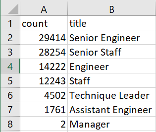
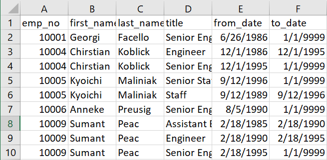
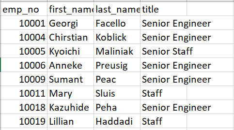
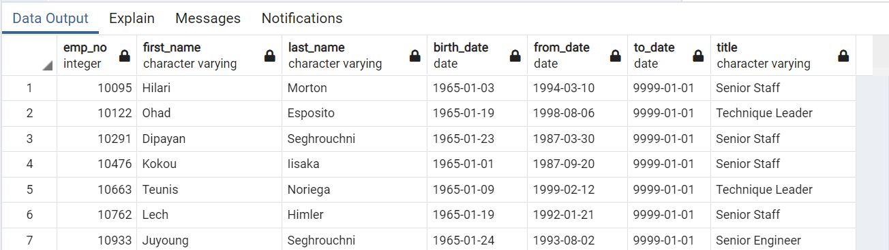

# Pewlett-Hackard-Analysis

## Project Overview
In this project we'll use PostgreSQL to analyze Pewlett Hackards employee database in order to help manage employee retirement/turnover. Specifically, we'll determine the number of retiring employees in each title, and identify which employees are able to engage in an employee mentorship program.

- Deliverable 1: The Number of Retiring Employees by Title
- Deliverable 2: The Employees Eligible for the Mentorship Program
- Deliverable 3: A written report on the employee database analysis

Resources: PostgreSQL, pgAdmin
Data Source: 

## Results

### Deliverable 1: The Number of Retiring Employees by Title

Here, you can see the number of retiring employees based on title.

Additionally, you can see the retirees by title and other employee data.

### Deliverable 2: The Employees Eligible for the Mentorship Program

Below are the employees who are eligible for the Mentorship Program. The full list is available as a CSV file in the data folder.

### Deliverable 3: A written report on the employee database analysis
Summary: 
- Provide high-level responses to the following questions:
- How many roles will need to be filled as the "silver tsunami" begins to make an impact?
- Are there enough qualified, retirement-ready employees in the departments to mentor the next generation of Pewlett Hackard employees?

- Provide two additional queries or tables that may provide more insight into the upcoming "silver tsunami."
